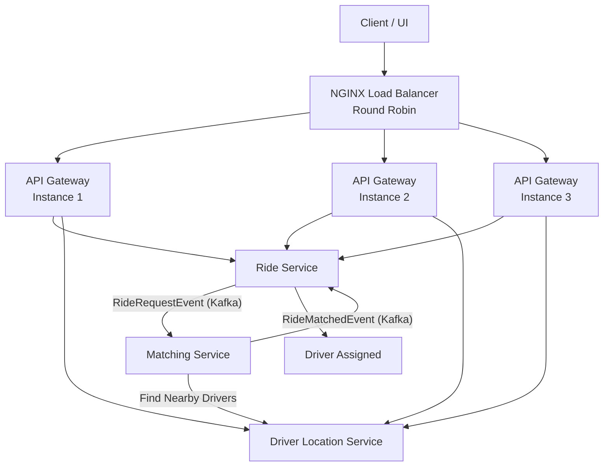

# 🚖 Ride Sharing Platform - Microservices Architecture

A production-style **Ride Sharing Platform** built using **Java, Spring Boot, Spring Cloud, Kafka, Redis, CockroachDB, Docker, and NGINX Load Balancer** following **Microservices Architecture**, **Event-Driven Design**, and **Hexagonal Architecture**.

The objective of this project is to demonstrate how modern distributed systems are built with scalability, resiliency, service discovery, asynchronous messaging, and horizontal scaling.

---

# Architecture



---

# Tech Stack

| Technology                  | Usage |
|-----------------------------|------|
| Java 17                     | Programming Language |
| Spring Boot                 | Microservices |
| Spring Cloud Gateway        | API Gateway |
| Spring Cloud Netflix Eureka | Service Discovery |
| Apache Kafka                | Event Streaming |
| Redis                       | Driver Location Cache |
| CockroachDB                 | Distributed SQL Database |
| Spring Data JPA             | Persistence |
| Docker                      | Containerization |
| Docker Compose              | Infrastructure |
| NGINX                       | Load Balancer |
| Maven                       | Dependency Management |

---

# Microservices

## 1. Discover Service

Responsible for service registration and discovery.

**Port**

```
8761
```

Responsibilities

- Eureka Server
- Service Registry
- Service Discovery
- Health Monitoring

---

## 2. API Gateway

Acts as the single entry point for all client requests.

Features

- Spring Cloud Gateway
- Eureka Integration
- Dynamic Routing
- Load Balancing
- Centralized API Entry

Three API Gateway instances are deployed behind NGINX.

```
API Gateway - Instance 1
API Gateway - Instance 2
API Gateway - Instance 3
```

---

## 3. Ride Service

Responsible for ride lifecycle management.

Port

```
8081
```

Responsibilities

- Create Ride
- Update Ride Status
- Publish Ride Request Event
- Persist Ride Information

---

## 4. Driver Location Service

Responsible for maintaining live driver locations.

Port

```
8083
```

Responsibilities

- Store Driver Locations
- Redis Cache
- Find Nearby Drivers
- Driver Availability

---

## 5. Matching Service

Responsible for assigning the nearest driver.

Port

```
8082
```

Responsibilities

- Consume Ride Request Event
- Search Nearby Drivers
- Match Driver
- Publish Ride Matched Event

---

# Infrastructure

## CockroachDB

Distributed SQL database.

Container

```
cockroachdb
```

Default Ports

```
26257
8080
```

---

## Apache Kafka

Event Streaming Platform.

Container

```
kafka
```

Ports

```
9092
9093
```

Topics

```
ride-request
ride-matched
```

---

## Redis Stack

Used for caching driver locations.

Container

```
redis
```

Ports

```
6379
8001
```

---

## NGINX

Acts as Layer-7 Reverse Proxy and Load Balancer.

Port

```
80
```

Load Balancing Algorithm

```
Round Robin
```

Routes traffic across

```
API Gateway Instance 1
API Gateway Instance 2
API Gateway Instance 3
```

---

# Docker Containers

| Container | Image |
|-----------|-------|
| discover-service | rdutta2/discover-service:v1 |
| ride-service | rdutta2/ride-service:v1 |
| matching-service | rdutta2/matching-service:v1 |
| driver-location-service | rdutta2/driver-location-service:v1 |
| api-gateway (3 replicas) | rdutta2/api-gateway:v1 |
| kafka | confluentinc/cp-kafka:7.6.0 |
| redis | redis/redis-stack |
| cockroachdb | cockroachdb/cockroach |
| nginx | nginx |

---

# Event Flow

### Step 1

Client creates a ride.

```
POST /rides
```

↓

Ride Service stores the ride.

↓

Ride Service publishes

```
RideRequestEvent
```

↓

Kafka

↓

Matching Service consumes the event.

↓

Matching Service requests nearby drivers from Driver Location Service.

↓

Nearest driver is selected.

↓

Matching Service publishes

```
RideMatchedEvent
```

↓

Ride Service updates ride status.

---

# Request Flow

```
Client

   |

NGINX

   |

API Gateway

   |

Ride Service

   |

Kafka

   |

Matching Service

   |

Driver Location Service

```

---

# Horizontal Scaling

The API Gateway is horizontally scaled.

```
                NGINX

                  |

        ----------------------

        |        |         |

      GW-1     GW-2      GW-3
```

Benefits

- High Availability
- Fault Tolerance
- Better Throughput
- Load Distribution
- Zero Single Point of Failure

---

# Service Discovery

All services register themselves with Eureka.

```
Ride Service
        |

Driver Location Service
        |

Matching Service
        |

API Gateway
        |

      Eureka
```

No hardcoded URLs are required between services.

---

# Design Patterns Used

- Microservices Architecture
- Event-Driven Architecture
- Hexagonal Architecture
- Publisher-Subscriber Pattern
- API Gateway Pattern
- Service Discovery Pattern
- Database per Service
- Cache Aside Pattern
- Load Balancer Pattern

---

# Project Structure

```
ride-sharing-platform

├── discover-service
├── api-gateway
├── ride-service
├── matching-service
├── driver-location-service
├── infrastructure
│   ├── kafka
│   ├── nginx
│   ├── redis
│   ├── cockroachdb
│   └── docker-compose
└── README.md
```
---

## 🚀 Exposed APIs

The platform exposes REST APIs through the **API Gateway**, which routes requests to the appropriate microservice registered with Eureka.

---

## 🚖 Ride Service APIs

| Method | Endpoint | Description |
|--------|----------|-------------|
| **POST** | `/api/v1/rides` | Create a new ride request |
| **GET** | `/api/v1/rides/{rideId}` | Get ride details by Ride ID |
| **PATCH** | `/api/v1/rides/{rideId}/assign?driverId={driverId}` | Assign a driver to a ride |
| **PATCH** | `/api/v1/rides/{rideId}/status?status={STATUS}` | Update ride status |
| **GET** | `/api/v1/rides/active/rider/{riderId}` | Get all active rides for a rider |

Supported Ride Status

```
 REQUESTED,
 MATCHING,
 DRIVER_ARRIVING,
 RIDE_STARTED,
 COMPLETED,
 CANCELLED
```

---

## 📍 Driver Location Service APIs

| Method | Endpoint | Description |
|--------|----------|-------------|
| **POST** | `/api/v1/locations/drivers/update` | Update driver's live GPS location |
| **GET** | `/api/v1/locations/drivers/nearby?lat={lat}&lon={lon}&radiusKm={radius}&limit={limit}` | Find nearby available drivers |
| **DELETE** | `/api/v1/locations/drivers/{driverId}` | Remove offline driver from Redis |

---

## 🌐 API Gateway

All APIs can be accessed via the NGINX Load Balancer.

```
http://localhost
```

Example

```http
POST http://localhost/api/v1/rides

GET http://localhost/api/v1/rides/{rideId}

POST http://localhost/api/v1/locations/drivers/update

GET http://localhost/api/v1/locations/drivers/nearby?lat=12.9716&lon=77.5946&radiusKm=5&limit=10
```

---

## 📮 Postman Collections

The repository includes ready-to-use Postman collections for API testing.

- **Ride Service API Collection** :contentReference[oaicite:0]{index=0}
- **Driver Location Service (Reactive Hexagonal) Collection** :contentReference[oaicite:1]{index=1}

Simply import these collections into Postman and update the `baseUrl` variable if needed.
---

# Running the Project

Clone the repository

```bash
git clone https://github.com/<your-username>/ride-sharing-platform.git
```

Start infrastructure

```bash
docker compose up -d
```

Verify running containers

```bash
docker ps
```

Open Eureka

```
http://localhost:8761
```

NGINX

```
http://localhost
```

CockroachDB Admin UI

```
http://localhost:8080
```

Redis Insight

```
http://localhost:8001
```

---

# Future Enhancements

- Kubernetes Deployment
- Helm Charts
- Prometheus Monitoring
- Grafana Dashboard
- OpenTelemetry
- Jaeger Tracing
- Resilience4j Circuit Breaker
- Distributed Transactions (Saga Pattern)
- JWT Authentication
- Rate Limiting
- Distributed Logging (ELK)

---

# Learning Outcomes

This project demonstrates:

- Microservices Development
- Spring Cloud Ecosystem
- Service Discovery
- API Gateway
- Event-Driven Communication
- Kafka Integration
- Redis Caching
- CockroachDB Integration
- Docker Containerization
- NGINX Load Balancing
- Horizontal Scaling
- Distributed System Design

---

# Author

**Raj Kumar Dutta**

Backend Engineer | Java | Spring Boot | Microservices | Kafka | Redis | Docker | Kubernetes | AWS

---
⭐ If you found this project useful, consider giving it a star on GitHub.